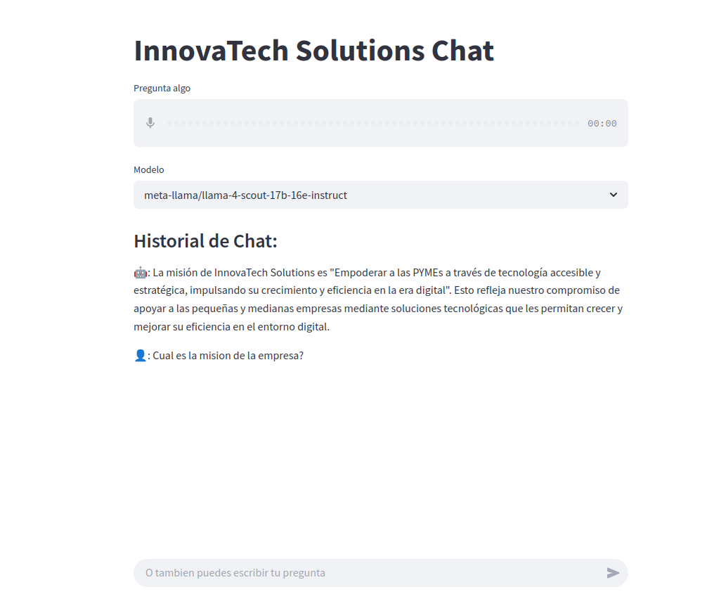

# InnovaTech - RAG + Python Agent Smart Assistant

This project implements an intelligent conversational assistant for a fictional company called "InnovaTech Solutions". It combines **Retrieval-Augmented Generation (RAG)** techniques to answer questions based on a company manual and a **Python Agent** capable of analyzing CSV data files for supplementary information.



## Overview

The main goal is to provide employees (or users) with a quick and efficient way to get answers to their questions about InnovaTech's policies, processes, or operational data.

The system operates in two main stages:

1.  **Manual Query (RAG):** When a user asks a question, the system first attempts to answer it using information contained in the `manual.txt` file. It uses text embeddings (generated with `Sentence-Transformers`) and similarity search to find the most relevant parts of the manual. These relevant sections are then passed, along with the user's question, to a Large Language Model (LLM) via the Groq API to generate a contextualized answer.
2.  **Data Analysis (Python Agent):** If the initial LLM determines it cannot answer the question based solely on the manual (indicated by returning a specific JSON structure), a Python Agent (built with Langchain) is activated. This agent has access to tools (specifically, a Python REPL with Pandas) to read and analyze CSV files located in the `datasets/` folder, extract the necessary information, and generate a final response.

## Key Features

*   **Conversational Interface:** Simple web interface created with Streamlit.
*   **Flexible Input:** Accepts questions via text or audio input (transcription via Groq Whisper API).
*   **Manual-Based Query (RAG):** Answers questions using the content of `manual.txt`.
*   **CSV Data Analysis:** The Python Agent can read and process `.csv` files in the `datasets/` folder using Pandas to answer data-based questions.
*   **LLM Model Selection:** Allows choosing from various LLM models available on Groq.
*   **Conversation History:** Maintains the context of the current conversation.
*   **Error Handling:** Includes basic error handling during agent execution and LLM interaction.

## Technologies Used

*   **Python 3.12**
*   **Langchain:** Main framework for building the RAG logic and the Agent.
    *   `langchain-groq`: For interacting with Groq LLMs and Whisper.
    *   `langchain_experimental`: For the Python Agent and `PythonREPLTool`.
    *   `langchain_core`: For messages and memory management.
*   **Sentence-Transformers:** For generating text embeddings from the manual.
*   **Pandas:** For CSV data manipulation and analysis by the Agent.
*   **Streamlit:** For creating the interactive web user interface.
*   **Groq API:** For accessing fast LLM models and Whisper audio transcription.
*   **python-dotenv:** For managing API keys.

## Project Structure

.
├── datasets/ # Folder for CSV files
│ ├── data_file_1.csv # Example CSV file (accessible by the agent)
│ └── ... # Other CSV files
├──manual/ # Folder for the manual and the embeddings
│ ├── manual.txt # Company manual (source for RAG)
│ └── embeddings.csv # Generated file with manual embeddings
├── llm.py # Main chat logic, RAG, and agent orchestration
├── main.py # Streamlit application code (UI)
├── vectorstore.py # Functions for generating and loading embeddings
├── requirements.txt # Project dependencies
└── .env # File to store API keys (DO NOT commit to Git)

## Installation and Setup

1.  **Clone the Repository:**
    ```bash
    git clone https://github.com/Riccino22/rag_advisor
    cd rag_advisor
    ```

2.  **Create a Virtual Environment (Recommended):**
    ```bash
    python -m venv venv
    # On Windows:
    venv\Scripts\activate
    # On macOS/Linux:
    source venv/bin/activate
    ```

3.  **Install Dependencies:**
    Make sure you have a `requirements.txt` file. If not, you can generate it with `pip freeze > requirements.txt` after installing the libraries manually:
    ```bash
    pip install -r requirements.txt
    # Or install manually:
    # pip install langchain langchain-groq langchain_experimental sentence-transformers pandas streamlit python-dotenv
    ```

4.  **Configure API Keys:**
    *   Create a file named `.env` in the project root.
    *   Add your Groq API key:
        ```
        GROQ_API_KEY=your_secret_groq_api_key
        ```

5.  **Prepare Data:**
    *   Place your company manual in `manual/manual.txt`.
    *   Place the CSV files that the agent should be able to analyze inside the `datasets/` folder.
    *   **Important:** The `embeddings.csv` file will be generated automatically the first time you run the application if it doesn't exist, by processing `manual/manual.txt`.

## Usage

1.  **Run the Streamlit Application:**
    ```bash
    streamlit run main.py
    ```

2.  **Interact with the Assistant:**
    *   Open your web browser to the address provided by Streamlit (usually `http://localhost:8501`).
    *   Select the Groq LLM model you want to use from the dropdown.
    *   Type your question in the chat input field or use the audio upload component to ask by voice.
    *   The assistant will process the question and display the answer. The chat history will update in the interface.

## How the Flow Works

1.  The user enters a question (text/audio) via the Streamlit interface (`main.py`).
2.  If audio, it's transcribed using Groq Whisper.
3.  The `chat` function in `llm.py` is called.
4.  Embeddings are loaded from `embeddings.csv` (or generated if non-existent) using `vectorstore.py`.
5.  The user's question is encoded into an embedding.
6.  The most similar chunks from the manual (`manual.txt`) are found using cosine similarity.
7.  A `final_prompt` is constructed, including the manual context, specific instructions, and the user's question.
8.  This prompt is sent to the selected Groq LLM via `ConversationChain`.
9.  **Decision Point:**
    *   **If the LLM answers directly:** That response is returned to the user.
    *   **If the LLM responds with a specific JSON:** This indicates it couldn't find the answer in the manual.
10. **Agent Activation (if applicable):**
    *   The summary is extracted from the JSON response.
    *   A `PythonREPLTool` and `create_python_agent` are initialized.
    *   The agent is prompted to answer the original question, using the previous LLM's summary and information about the available CSV files in `datasets/` as context. The agent can use Pandas to read and analyze these files.
    *   The agent's final response is returned to the user.
11. The conversation memory (`ConversationBufferMemory`) is updated.
12. The response and history are displayed in Streamlit.

## Contact

[Riccardo Inojosa / Riccino22] - riccardoinojosa@gmail.com